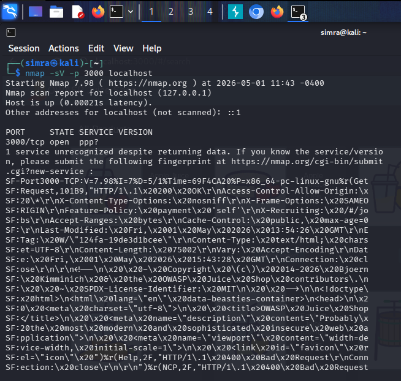
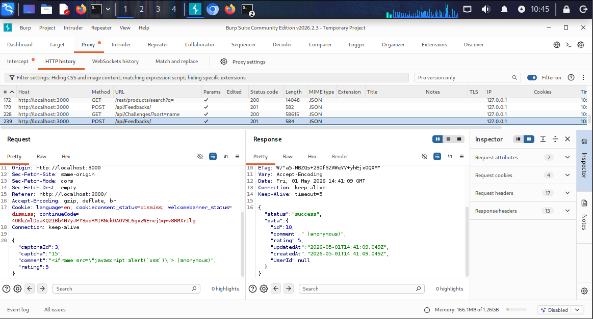
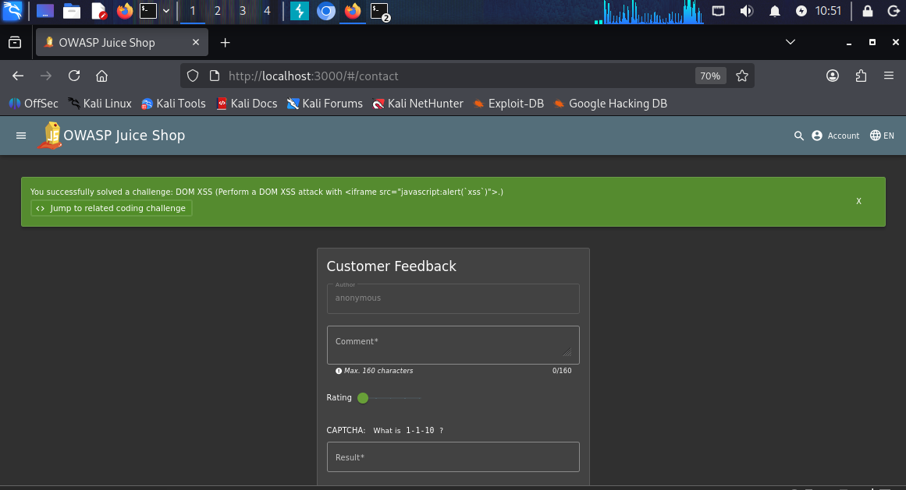
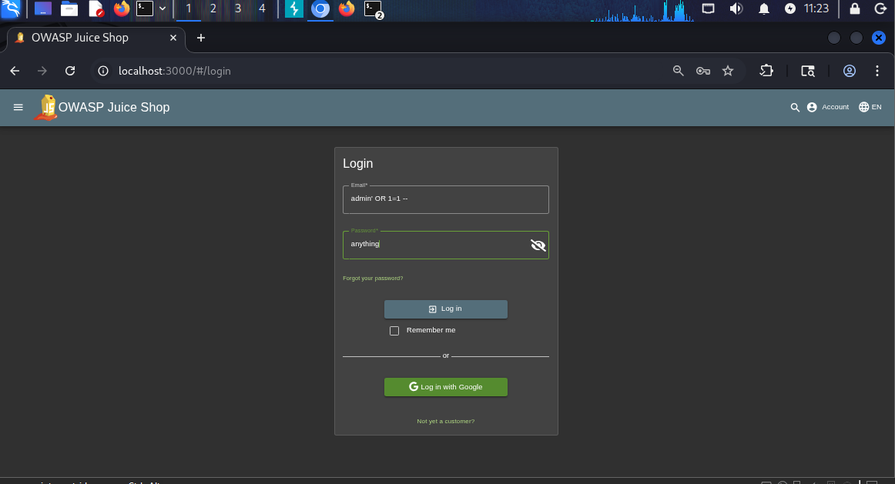
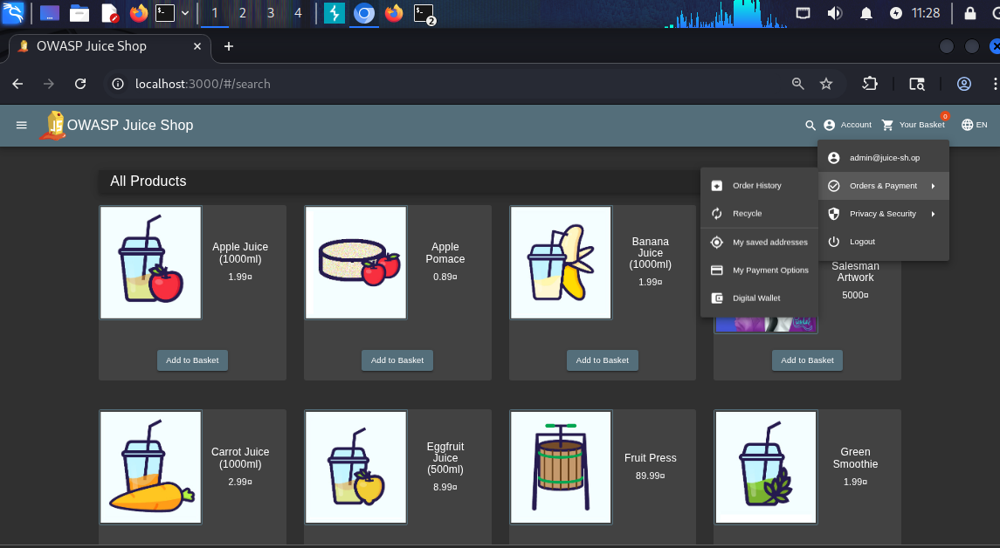
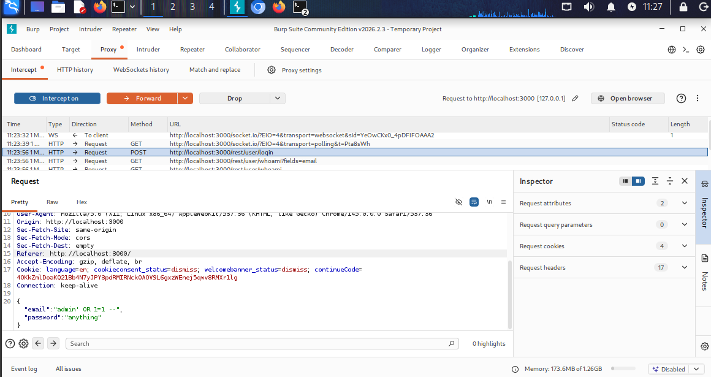

# OWASP Web Security Audit Report

## 📌 Overview
This project demonstrates a practical web application security assessment based on OWASP Top 10 principles. The objective was to identify, analyze, and document common web vulnerabilities in a controlled lab environment using industry-relevant tools and methodologies.

---

## 🎯 Objectives
- Perform vulnerability assessment on a web application  
- Identify and analyze common security flaws  
- Demonstrate real-world exploitation scenarios  
- Document findings in a structured VAPT-style report  

---

## 🛠️ Tools Used
- Burp Suite (intercepting proxy & request analysis)  
- Nmap (basic reconnaissance)  
- Web Browser (manual testing)  

---

## 🔍 Scope of Testing
Testing was conducted on a deliberately vulnerable application in a controlled lab environment. No real-world systems or user data were targeted.

---

### Network Reconnaissance (Nmap)

- **Tool Used:** Nmap  
- **Command:** nmap -sV -p 3000 localhost  
- **Purpose:** Identified open ports and services running on the target system.

#### Result:

- Port 3000 is open and running a web application  
- Service identified as HTTP  
- Confirmed target environment for web security testing

---

## ⚠️ Vulnerabilities Identified

---

### 1. Cross-Site Scripting (XSS)

- **Risk Level:** Medium  
- **Type:** Stored / DOM-based XSS  
- **Description:** User input was not properly sanitized before being processed and rendered, allowing injection of malicious JavaScript.  
- **Impact:** Attackers can execute scripts in the victim’s browser, potentially leading to session hijacking or data theft.  
- **Fix:** Implement proper input validation and output encoding mechanisms.  

#### 📸 Proof of Concept

**Burp Suite Request (Payload Injection):**

**Execution Confirmation:**

> Note: Execution was validated via application behavior (challenge completion), indicating successful payload processing.

---

### 2. SQL Injection (Login Bypass)

- **Risk Level:** High  
- **Type:** Authentication Bypass via SQL Injection  
- **Description:** The application failed to properly sanitize user input in the login form, allowing SQL injection payloads to bypass authentication controls.  
- **Impact:** Unauthorized access to the application without valid credentials.  
- **Fix:** Use parameterized queries and prepared statements to prevent direct SQL query manipulation.

---

#### 📸 Proof of Concept

**1. SQL Injection Payload (Input):**  

**2. Successful Login Bypass Result:**  

**3. Burp Suite Request (Payload Injection):**  

---

#### 🧠 Attack Summary
The payload `admin' OR 1=1 --` was used to manipulate the authentication query, resulting in successful login without valid credentials.

---

#### ⚖️ Security Impact
This vulnerability allows attackers to completely bypass authentication mechanisms and gain unauthorized access to user accounts or administrative panels.

---

### 3. Weak Authentication

- **Risk Level:** Medium  
- **Description:** The application allowed access using weak/default credentials.  
- **Impact:** Unauthorized users can gain access to restricted areas.  
- **Fix:** Enforce strong password policies and implement account lockout mechanisms.  

#### 📸 Proof of Concept

---

## 📊 Key Learnings
- Hands-on experience with OWASP Top 10 vulnerabilities  
- Understanding of real-world attack and defense mechanisms  
- Practical usage of Burp Suite for request interception and analysis  
- Importance of secure coding practices  

---

## 🚀 Skills Demonstrated
- Web Application Security Testing (VAPT Basics)  
- Vulnerability Identification & Analysis  
- Manual Testing Techniques  
- Security Reporting & Documentation  

---

## ⚖️ Ethical Note
This project was conducted strictly in a controlled lab environment for educational purposes. No unauthorized systems were tested.
